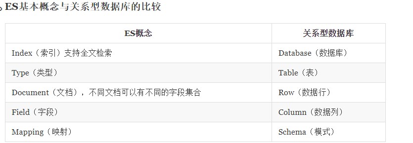

# elasticsearch + kibana
  golang基于elasticsearch的实践，采用docker-compose快速部署环境，利用go抓取部分数据入库后对比mysql和es的查询速度

# 相关地址信息
- docker 镜像加速地址 https://gist.github.com/y0ngb1n/7e8f16af3242c7815e7ca2f0833d3ea6
- 加速地址： https://docker.m.daocloud.io/
- es、kibana部署参考教程 https://juejin.cn/post/7241374490491879480
- https://www.topgoer.com/%E6%95%B0%E6%8D%AE%E5%BA%93%E6%93%8D%E4%BD%9C/go%E6%93%8D%E4%BD%9Celasticsearch/elasticsearch%E4%BB%8B%E7%BB%8D.html
- 中文教程：https://learnku.com/docs/elasticsearch73/7.3/data-in-documents-and-indices/6446

# 步骤
- docker-compose up 拉取镜像和启动服务
- 修改用户密码
  - 进入容器：docker exec -it elasticsearch /bin/bash
  - 设置7个用户的密码-测试环境建议同kibana.yaml配置的elasticsearch.password一致： /usr/share/elasticsearch/bin/elasticsearch-setup-passwords interactive
- 访问 localhost:9200 和 localhost:5601 验证 elasticsearch 服务和 kibana 是否启动成功
- docker logs {elasticsearch|kibana} 查询相关日志
- data 目录中将测试数据导入es中，访问head插件查看bank索引信息和相关数据

# Elasticsearch 基本介绍
- 在 7.0 以及之后的版本中 Type 被废弃了。一个 index 中只有一个默认的 type，即 _doc
- 

